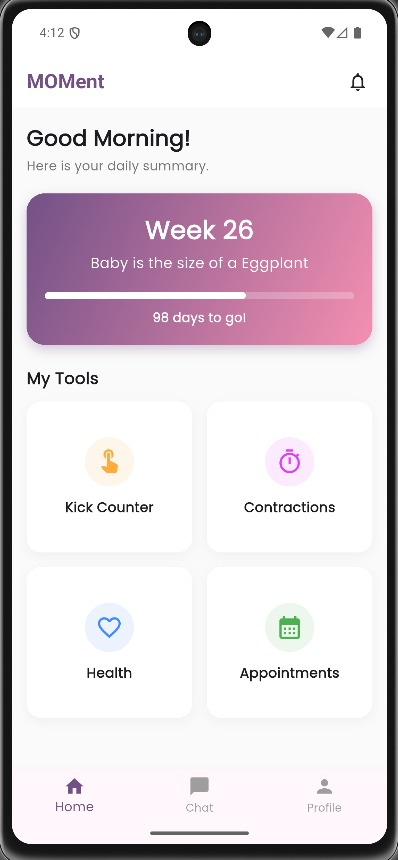
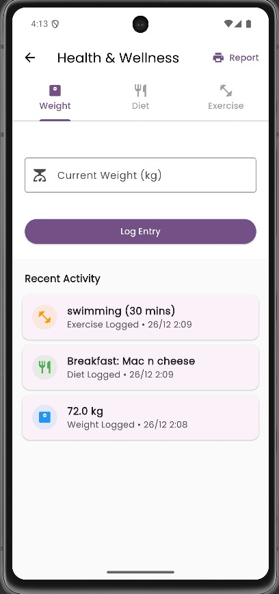
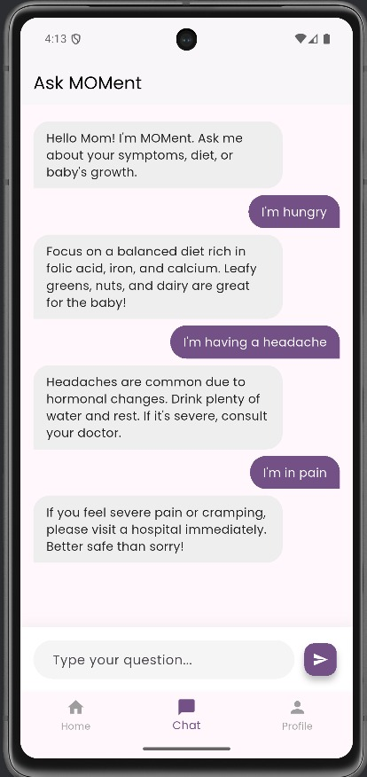
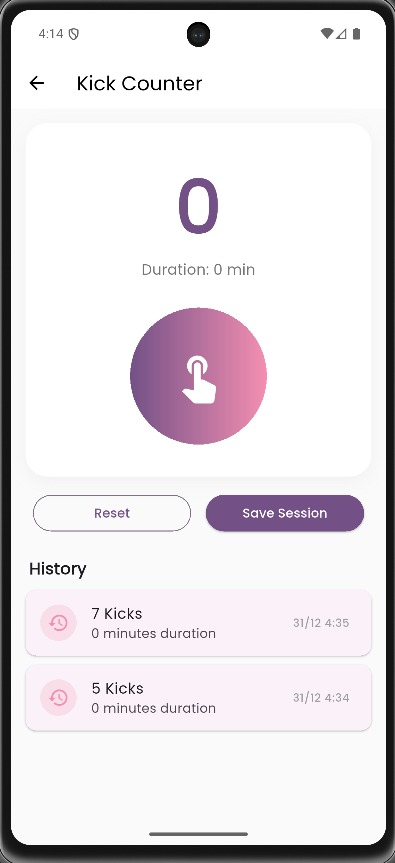
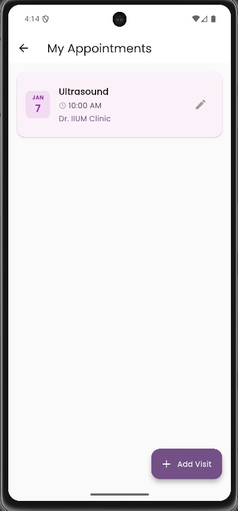
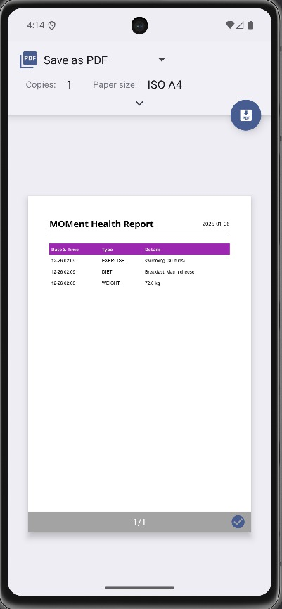

# MOMent: Pregnancy Tracking Application 🤰📱

**MOMent** is a comprehensive mobile application designed to assist expectant mothers in monitoring their pregnancy journey. Built with **Flutter** and **Firebase**, it serves as a centralized hub for tracking health metrics, milestones, and appointments, ensuring a safer and more organized pregnancy experience.

## 🚀 Features

### 1. 🏠 Smart Dashboard
* **Dynamic Progress Tracking:** Calculates current pregnancy week and days remaining until due date.
* **Baby Size Visualization:** Fun comparisons of baby size to fruits (e.g., "Size of a Lime") that update weekly.

### 2. 💬 Automated Chat Assistant
* **Instant Advice:** A built-in rule-based chatbot that provides immediate answers to common concerns (e.g., "headache", "diet", "sleep") without needing an internet connection.
* **Offline Capable:** Ensures mothers can get reassurance anytime, anywhere.

### 3. 🍎 Health & Wellness Logger
* **Unified Tracking:** Dedicated tabs to log **Weight**, **Diet**, and **Exercise**.
* **Historical Data:** View a timeline of all health entries.
* **📄 PDF Report:** Generate and share a professional PDF health report directly with doctors.

### 4. 🦶 Prenatal Tools
* **Kick Counter:** Track fetal movements with a simple tap. Includes "Swipe-to-Delete" for accidental entries.
* **Contraction Timer:** Monitor labor signs with precision.
* **Appointment Manager:** Add, edit, and track upcoming prenatal checkups.

### 5. 🔒 Privacy & Security
* **Secure Auth:** Powered by Firebase Authentication.
* **Data Control:** Full "Delete Account" functionality that permanently wipes user data from the cloud, ensuring GDPR/Privacy compliance.

---

## 🛠️ Tech Stack

* **Frontend:** Flutter (Dart)
* **Backend:** Firebase (Authentication, Cloud Firestore)
* **Logic:** Custom local rule-engine for Chatbot
* **Packages:**
    * `cloud_firestore` & `firebase_auth` (Backend)
    * `pdf` & `printing` (Reporting)
    * `intl` (Date formatting)

---

## 📸 Screenshots

|                        Dashboard                         |                     Health Logger                     |                      Chat Bot                       |
|:--------------------------------------------------------:|:-----------------------------------------------------:|:---------------------------------------------------:|
|  |  |  |

|                     Kick Counter                     |                        Appointments                         |                     PDF Report                     |
|:----------------------------------------------------:|:-----------------------------------------------------------:|:--------------------------------------------------:|
|  |  |  |

---

## 🏁 Getting Started

To run this project locally:

1.  **Clone the repository:**
    ```bash
    git clone https://github.com/MhdFadlyy/MOMent-Pregnancy-Tracker
    ```
2.  **Install Dependencies:**
    ```bash
    flutter pub get
    ```
3.  **Firebase Setup:**
    * This project relies on `google-services.json` (Android) and `GoogleService-Info.plist` (iOS).
    * *Note: For this student project, keys are included. For production, you must generate your own in the Firebase Console.*
4.  **Run the App:**
    ```bash
    flutter run
    ```

---

## 📄 License

Name        : FADLY MUHAMMAD
Matric No   : 2117999
Course      : BIT
This project was developed as a **Final Year Project (FYP)** for the Bachelor of Information Technology program.

---